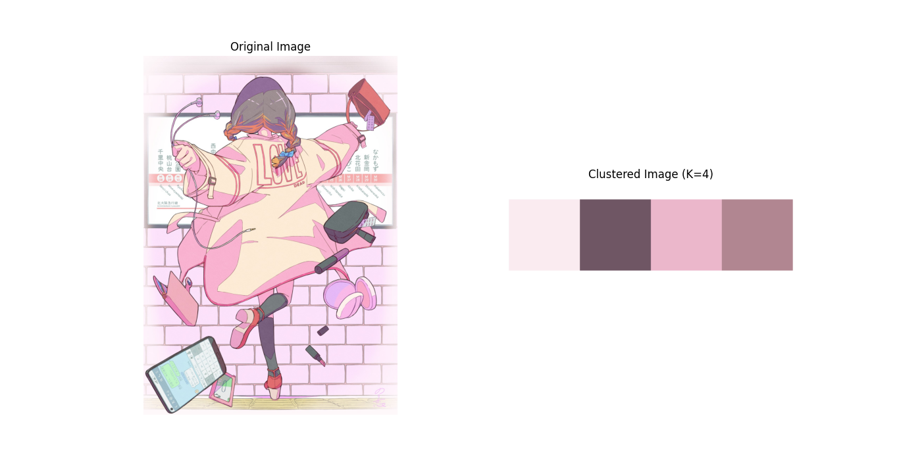

# GetMainColor
画像に使われているメインカラーを調べるプログラム

## 使用技術・ライブラリ
- python
  - tkinter
  - matplotlib
  - opencv
  - PIL
  - sklearn
 
## 使用例
### 入力
以下の画像（のり恋さんの「素敵なところへ連れてって」）を入力すると...


### 出力
下記のように分析結果が出ました。これで、画像のメインカラーを調べやすくなった!!!!
```
1位：#faebf0
2位：#6f5664
3位：#ebb7cb
4位：#b18691
```



# 参考
- [のり恋｜素敵なところへ連れてって](https://www.pixiv.net/artworks/91897879)
- [Pythonで画像からメインカラーを抽出する](https://qiita.com/simonritchie/items/396112fb8a10702a3644)
